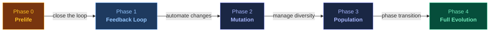

# Evolving Agents

**From Nowak's Evolvability Equations to AI Agent Architectures**
{: .fs-6 .fw-300 }

A living research collection and practical design principles at the intersection of evolutionary dynamics, self-evolving agents, and multi-agent systems.
{: .fs-5 .fw-300 }

[Browse Research](/evolving-agents/research/){: .btn .btn-primary .fs-5 .mb-4 .mb-md-0 .mr-2 }
[7 Principles](/evolving-agents/principles/){: .btn .fs-5 .mb-4 .mb-md-0 .mr-2 }
[Counter-Arguments](/evolving-agents/research/counter-arguments){: .btn .fs-5 .mb-4 .mb-md-0 }

# Evolving Agents

**Von Nowaks Evolvierbarkeits-Gleichungen zu KI-Agent-Architekturen**
{: .fs-6 .fw-300 }

Eine lebende Forschungssammlung und praktische Design-Prinzipien an der Schnittstelle von Evolutionsdynamik, selbst-evolvierenden Agents und Multi-Agent-Systemen.
{: .fs-5 .fw-300 }

[Forschung durchsuchen](/evolving-agents/research/){: .btn .btn-primary .fs-5 .mb-4 .mb-md-0 .mr-2 }
[7 Prinzipien](/evolving-agents/principles/){: .btn .fs-5 .mb-4 .mb-md-0 .mr-2 }
[Gegenargumente](/evolving-agents/research/counter-arguments){: .btn .fs-5 .mb-4 .mb-md-0 }

---

  

    55+
    PapersPapers
  

  

    7
    PrinciplesPrinzipien
  

  

    9
    Counter-ArgumentsGegenargumente
  

  

    9
    CategoriesKategorien
  

---

## The Originator Equation

Martin A. Nowak (Harvard, Program for Evolutionary Dynamics) formalized a fundamental question: **When do chemical kinetics become evolutionary dynamics?** His answer — the Originator Equation — describes the transition from "Prelife" (generative chemistry without replication) to "Life" (systems with replication and selection):

## Die Originator-Gleichung

Martin A. Nowak (Harvard, Program for Evolutionary Dynamics) formalisierte eine fundamentale Frage: **Wann werden chemische Kinetiken zu evolutionärer Dynamik?** Seine Antwort — die Originator-Gleichung — beschreibt den Übergang von "Prelife" (generative Chemie ohne Replikation) zu "Life" (Systeme mit Replikation und Selektion):

  <code style="font-size:1.3em;color:#e6edf3;letter-spacing:0.5px">ẋᵢ = aᵢ · xᵢ' − (d + aᵢ₀ + aᵢ₁) · xᵢ + r · xᵢ · (fᵢ − φ)</code>

<table>
<tr><td style="white-space:nowrap;padding-right:16px"><code>aᵢ · xᵢ'</code></td><td><strong>Prelife dynamics</strong> — sequences arise from precursors through addition of activated monomers</td></tr>
<tr><td style="padding-right:16px"><code>(d + aᵢ₀ + aᵢ₁) · xᵢ</code></td><td><strong>Decay</strong> — sequences degrade and get processed into longer sequences</td></tr>
<tr><td style="padding-right:16px"><code>r · xᵢ · (fᵢ − φ)</code></td><td><strong>Selection</strong> — standard selection equation of evolutionary dynamics</td></tr>
</table>

<strong>Two limiting cases:</strong> When <code>r → 0</code>, no replication — pure Prelife. When <code>r → ∞</code>, replication dominates — standard evolution. Between them lies a <strong>phase transition</strong> at a critical replication rate <code>rₓ</code> where selection "switches on."

<a href="/evolving-agents/research/nowak-synthesis">Full mathematical synthesis →</a>

<table>
<tr><td style="white-space:nowrap;padding-right:16px"><code>aᵢ · xᵢ'</code></td><td><strong>Prelife-Dynamik</strong> — Sequenzen entstehen aus Vorläufern durch Addition aktivierter Monomere</td></tr>
<tr><td style="padding-right:16px"><code>(d + aᵢ₀ + aᵢ₁) · xᵢ</code></td><td><strong>Zerfall</strong> — Sequenzen zerfallen und werden zu längeren Sequenzen verarbeitet</td></tr>
<tr><td style="padding-right:16px"><code>r · xᵢ · (fᵢ − φ)</code></td><td><strong>Selektion</strong> — Standard-Selektionsgleichung der Evolutionsdynamik</td></tr>
</table>

<strong>Zwei Grenzfälle:</strong> Bei <code>r → 0</code> keine Replikation — reines Prelife. Bei <code>r → ∞</code> dominiert Replikation — Standard-Evolution. Dazwischen liegt ein <strong>Phasenübergang</strong> bei einer kritischen Replikationsrate <code>rₓ</code>, an dem Selektion "einschaltet."

<a href="/evolving-agents/research/nowak-synthesis">Vollständige mathematische Synthese →</a>

---

## The Core Insight

> There is a structural analogy between biological evolution and agent system improvement. Replication, mutation, and selection map onto workflow reuse, prompt variation, and evaluation. This analogy is a **design heuristic**, not a formal proof — see [Counter-Arguments](/evolving-agents/research/counter-arguments) for where it breaks.
{: .key-insight }

## Die Kernerkenntnis

> Es gibt eine strukturelle Analogie zwischen biologischer Evolution und der Verbesserung von Agent-Systemen. Replikation, Mutation und Selektion entsprechen Workflow-Wiederverwendung, Prompt-Variation und Evaluation. Diese Analogie ist eine **Design-Heuristik**, kein formaler Beweis — siehe [Gegenargumente](/evolving-agents/research/counter-arguments) für die Bruchstellen.
{: .key-insight }

---

<h2>Explore</h2>

  

    <h3>Nowak Synthesis</h3>
    
The Originator equation, phase transitions, error threshold — mapped to agent systems.

    <a href="/evolving-agents/research/nowak-synthesis">Read the synthesis →</a>
  

  

    <h3>Paper Registry</h3>
    
55+ papers across 9 categories. 15 must-reads. Prioritized, with clickable arXiv links.

    <a href="/evolving-agents/research/paper-registry">Browse papers →</a>
  

  

    <h3>Deep Dive: EvoFlow, MCE, AgentFactory</h3>
    
The 3 papers that bridge evolutionary theory to agent practice.

    <a href="/evolving-agents/research/deep-dive-evoflow-mce-agentfactory">Read deep dive →</a>
  

  

    <h3>7 Design Principles</h3>
    
Actionable rules derived from evolutionary theory. Including P7 on knowledge persistence.

    <a href="/evolving-agents/principles/">See principles →</a>
  

  

    <h3>Counter-Arguments</h3>
    
9 critiques of the Nowak-agent analogy. 3 rated STRONG. Honest about where the thesis breaks.

    <a href="/evolving-agents/research/counter-arguments">Read critiques →</a>
  

  

    <h3>Phase 1: Feedback Loop</h3>
    
Engineering spec: SQL schema, Pareto views, alert triggers.

    <a href="/evolving-agents/specs/phase-1-feedback-loop">See spec →</a>
  

<h2>Erkunden</h2>

  

    <h3>Nowak-Synthese</h3>
    
Die Originator-Gleichung, Phasenübergänge, Error Threshold — auf Agent-Systeme übertragen.

    <a href="/evolving-agents/research/nowak-synthesis">Synthese lesen →</a>
  

  

    <h3>Paper-Registry</h3>
    
55+ Papers in 9 Kategorien. 15 Must-Reads. Priorisiert, mit klickbaren arXiv-Links.

    <a href="/evolving-agents/research/paper-registry">Papers durchsuchen →</a>
  

  

    <h3>Deep Dive: EvoFlow, MCE, AgentFactory</h3>
    
Die 3 Papers, die Evolutionstheorie mit Agent-Praxis verbinden.

    <a href="/evolving-agents/research/deep-dive-evoflow-mce-agentfactory">Deep Dive lesen →</a>
  

  

    <h3>7 Design-Prinzipien</h3>
    
Handlungsorientierte Regeln aus der Evolutionstheorie. Inkl. P7 zur Wissenspersistenz.

    <a href="/evolving-agents/principles/">Prinzipien ansehen →</a>
  

  

    <h3>Gegenargumente</h3>
    
9 Kritiken der Nowak-Agent-Analogie. 3 als STARK bewertet. Ehrlich, wo die These bricht.

    <a href="/evolving-agents/research/counter-arguments">Kritiken lesen →</a>
  

  

    <h3>Phase 1: Feedback-Loop</h3>
    
Engineering-Spec: SQL-Schema, Pareto-Views, Alert-Trigger.

    <a href="/evolving-agents/specs/phase-1-feedback-loop">Spec ansehen →</a>
  

---

## The Bridge: Nowak to Agents

| Biology (Nowak) | Agent System | Example |
|:---|:---|:---|
| Sequence / Replicator | Agent config (prompt + tools + memory) | A skill file |
| Fitness | Performance metric | Quality score + token cost |
| Mutation | Prompt variation, tool swap | TextGrad optimization |
| Selection (φ) | Evaluation + keep/discard | Quality gate agent |
| Error Threshold | Max complexity before collapse | Context window limits |
| Phase Transition (rₓ) | When workflows emerge | Manual → automated |

> This table shows **structural analogies**, not proven isomorphisms. Agent evolution is [Lamarckian, not Darwinian](/evolving-agents/research/counter-arguments#g1-agent-systeme-sind-lamarckisch-nicht-darwinistisch-stark) — directed optimization, not random mutation.
{: .transparency }

## Die Brücke: Nowak zu Agents

| Biologie (Nowak) | Agent-System | Beispiel |
|:---|:---|:---|
| Sequenz / Replikator | Agent-Konfiguration (Prompt + Tools + Memory) | Eine Skill-Datei |
| Fitness | Performance-Metrik | Quality Score + Token-Kosten |
| Mutation | Prompt-Variation, Tool-Swap | TextGrad-Optimierung |
| Selektion (φ) | Evaluation + Behalten/Verwerfen | Quality-Gate Agent |
| Error Threshold | Max. Komplexität vor Zusammenbruch | Context-Window-Grenzen |
| Phasenübergang (rₓ) | Wann Workflows emergieren | Manuell → automatisiert |

> Diese Tabelle zeigt **strukturelle Analogien**, keine bewiesenen Isomorphismen. Agent-Evolution ist [lamarckisch, nicht darwinistisch](/evolving-agents/research/counter-arguments#g1-agent-systeme-sind-lamarckisch-nicht-darwinistisch-stark) — gerichtete Optimierung, keine zufällige Mutation.
{: .transparency }

---

## The Upgrade Path

> Most agent systems are in **Phase 0**. [Phase 1 is specified and ready to implement](/evolving-agents/specs/phase-1-feedback-loop).
{: .note }

> Die meisten Agent-Systeme sind in **Phase 0**. [Phase 1 ist spezifiziert und bereit zur Implementierung](/evolving-agents/specs/phase-1-feedback-loop).
{: .note }

---

## Key Discovery: EvoFlow

[EvoFlow](https://arxiv.org/abs/2502.07373) (Zhang et al., 2025) uses niching evolutionary algorithms to evolve agent workflows. It surpassed o1-preview at **12.4% of its inference cost** using open-source models.

- Tag-based parent retrieval
- Crossover + 3 mutation types (LLM, prompt, operator)
- Niching-based selection maintaining diversity along the Pareto front

## Schlüsselentdeckung: EvoFlow

[EvoFlow](https://arxiv.org/abs/2502.07373) (Zhang et al., 2025) nutzt Niching-Evolutionsalgorithmen zur Workflow-Evolution. Es übertraf o1-preview bei **12,4% der Inferenzkosten** mit Open-Source-Modellen.

- Tag-basierte Eltern-Auswahl
- Crossover + 3 Mutationstypen (LLM, Prompt, Operator)
- Niching-basierte Selektion zur Diversitätserhaltung entlang der Pareto-Front

---

## Why This Exists

Anyone building AI agent systems hits the same problems: when to change workflows, how to balance exploration and exploitation, why some multi-agent setups get worse when you add more agents. These are the **same problems** Martin Nowak formalized for biological systems in the 2000s.

This repo maps the territory — connecting the biology, the papers, and the engineering into something practitioners can actually use. And it stress-tests its own conclusions: the [counter-arguments](/evolving-agents/research/counter-arguments) page exists because the strongest version of an idea is the one that knows its own weaknesses.

## Warum es das gibt

Jeder, der KI-Agent-Systeme baut, trifft auf dieselben Probleme: Wann Workflows ändern, wie Exploration und Exploitation balancieren, warum manche Multi-Agent-Setups schlechter werden wenn man mehr Agents hinzufügt. Das sind die **gleichen Probleme**, die Martin Nowak in den 2000ern für biologische Systeme formalisiert hat.

Dieses Repo kartiert das Territorium — es verbindet die Biologie, die Papers und das Engineering zu etwas, das Praktiker tatsächlich nutzen können. Und es stress-testet seine eigenen Schlussfolgerungen: Die [Gegenargumente](/evolving-agents/research/counter-arguments)-Seite existiert, weil die stärkste Version einer Idee diejenige ist, die ihre eigenen Schwächen kennt.

---

<h2>FAQ</h2>

<strong>Is this a formal proof that agent systems are evolutionary?</strong>

No. It's a structural analogy — useful as a design heuristic, not a mathematical proof.

<strong>Were these papers actually read?</strong>

Abstracts and summaries — no full-text reads. All numbers were cross-checked against 2+ sources. See <a href="/evolving-agents/meta/limitations">Limitations</a>.

<strong>What can I actually DO with this?</strong>

(1) Use the <a href="/evolving-agents/principles/">7 principles</a> as a design checklist. (2) Implement the <a href="/evolving-agents/specs/phase-1-feedback-loop">Phase 1 feedback loop</a>. (3) Use the <a href="/evolving-agents/research/paper-registry">paper registry</a> to find what to read next.

<h2>FAQ</h2>

<strong>Ist das ein formaler Beweis, dass Agent-Systeme evolutionär sind?</strong>

Nein. Es ist eine strukturelle Analogie — nützlich als Design-Heuristik, kein mathematischer Beweis.

<strong>Wurden die Papers tatsächlich gelesen?</strong>

Abstracts und Zusammenfassungen — keine Volltextlektüre. Alle Zahlen wurden gegen 2+ Quellen geprüft. Siehe <a href="/evolving-agents/meta/limitations">Limitationen</a>.

<strong>Was kann ich konkret damit machen?</strong>

(1) Die <a href="/evolving-agents/principles/">7 Prinzipien</a> als Design-Checkliste nutzen. (2) Den <a href="/evolving-agents/specs/phase-1-feedback-loop">Phase-1-Feedback-Loop</a> implementieren. (3) Die <a href="/evolving-agents/research/paper-registry">Paper-Registry</a> nutzen.

---

## Limitations

> **No paper was read in full.** Analysis is based on abstracts and summaries. Counter-arguments have been [documented](/evolving-agents/research/counter-arguments). See [full limitations](/evolving-agents/meta/limitations).
{: .warning }

## Limitationen

> **Kein Paper wurde im Volltext gelesen.** Die Analyse basiert auf Abstracts und Zusammenfassungen. Gegenargumente wurden [dokumentiert](/evolving-agents/research/counter-arguments). Siehe [vollständige Limitationen](/evolving-agents/meta/limitations).
{: .warning }

