# Evolving Agents

**From Nowak's Evolvability Equations to AI Agent Architectures**
{: .fs-6 .fw-300 }

A living research collection and practical design principles at the intersection of evolutionary dynamics, self-evolving agents, and multi-agent systems.
{: .fs-5 .fw-300 }

[Browse Research](/evolving-agents/research/){: .btn .btn-primary .fs-5 .mb-4 .mb-md-0 .mr-2 }
[7 Principles](/evolving-agents/principles/){: .btn .fs-5 .mb-4 .mb-md-0 .mr-2 }
[Counter-Arguments](/evolving-agents/research/counter-arguments){: .btn .fs-5 .mb-4 .mb-md-0 }

# Evolving Agents

**Von Nowaks Evolvierbarkeits-Gleichungen zu KI-Agent-Architekturen**
{: .fs-6 .fw-300 }

Eine lebende Forschungssammlung und praktische Design-Prinzipien an der Schnittstelle von Evolutionsdynamik, selbst-evolvierenden Agents und Multi-Agent-Systemen.
{: .fs-5 .fw-300 }

[Forschung durchsuchen](/evolving-agents/research/){: .btn .btn-primary .fs-5 .mb-4 .mb-md-0 .mr-2 }
[7 Prinzipien](/evolving-agents/principles/){: .btn .fs-5 .mb-4 .mb-md-0 .mr-2 }
[Gegenargumente](/evolving-agents/research/counter-arguments){: .btn .fs-5 .mb-4 .mb-md-0 }

---

  

    55+
    PapersPapers
  

  

    7
    PrinciplesPrinzipien
  

  

    9
    Counter-ArgumentsGegenargumente
  

  

    9
    CategoriesKategorien
  

---

## The Core Insight

{: .key-insight }
> There is a structural analogy between biological evolution and agent system improvement. Replication, mutation, and selection map onto workflow reuse, prompt variation, and evaluation. This analogy is a **design heuristic**, not a formal proof — see [Counter-Arguments](/evolving-agents/research/counter-arguments) for where it breaks.

## Die Kernerkenntnis

{: .key-insight }
> Es gibt eine strukturelle Analogie zwischen biologischer Evolution und der Verbesserung von Agent-Systemen. Replikation, Mutation und Selektion entsprechen Workflow-Wiederverwendung, Prompt-Variation und Evaluation. Diese Analogie ist eine **Design-Heuristik**, kein formaler Beweis — siehe [Gegenargumente](/evolving-agents/research/counter-arguments) für die Bruchstellen.

---

## Explore

  

    <h3>Nowak Synthesis</h3>
    
The Originator equation, phase transitions, error threshold — mapped to agent systems. With glossary.

    <a href="/evolving-agents/research/nowak-synthesis">Read the synthesis &rarr;</a>
  

  

    <h3>Paper Registry</h3>
    
55+ papers across 9 categories. 15 must-reads. Prioritized, with clickable arXiv links.

    <a href="/evolving-agents/research/paper-registry">Browse papers &rarr;</a>
  

  

    <h3>Deep Dive: EvoFlow, MCE, AgentFactory</h3>
    
The 3 papers that bridge evolutionary theory to agent practice. Architecture comparison.

    <a href="/evolving-agents/research/deep-dive-evoflow-mce-agentfactory">Read deep dive &rarr;</a>
  

  

    <h3>7 Design Principles</h3>
    
Actionable rules derived from evolutionary theory. Including P6 from the strongest counter-argument.

    <a href="/evolving-agents/principles/">See principles &rarr;</a>
  

  

    <h3>Counter-Arguments</h3>
    
9 critiques of the Nowak-agent analogy. 3 rated STRONG. Honest about where the thesis breaks.

    <a href="/evolving-agents/research/counter-arguments">Read critiques &rarr;</a>
  

  

    <h3>Phase 1: Feedback Loop</h3>
    
Engineering spec: SQL schema, Pareto views, alert triggers. Closing the evolutionary loop.

    <a href="/evolving-agents/specs/phase-1-feedback-loop">See spec &rarr;</a>
  

## Erkunden

  

    <h3>Nowak-Synthese</h3>
    
Die Originator-Gleichung, Phasenübergänge, Error Threshold — auf Agent-Systeme übertragen. Mit Glossar.

    <a href="/evolving-agents/research/nowak-synthesis">Synthese lesen &rarr;</a>
  

  

    <h3>Paper-Registry</h3>
    
55+ Papers in 9 Kategorien. 15 Must-Reads. Priorisiert, mit klickbaren arXiv-Links.

    <a href="/evolving-agents/research/paper-registry">Papers durchsuchen &rarr;</a>
  

  

    <h3>Deep Dive: EvoFlow, MCE, AgentFactory</h3>
    
Die 3 Papers, die Evolutionstheorie mit Agent-Praxis verbinden. Architekturvergleich.

    <a href="/evolving-agents/research/deep-dive-evoflow-mce-agentfactory">Deep Dive lesen &rarr;</a>
  

  

    <h3>7 Design-Prinzipien</h3>
    
Handlungsorientierte Regeln aus der Evolutionstheorie. Inkl. P6 aus dem stärksten Gegenargument.

    <a href="/evolving-agents/principles/">Prinzipien ansehen &rarr;</a>
  

  

    <h3>Gegenargumente</h3>
    
9 Kritiken der Nowak-Agent-Analogie. 3 als STARK bewertet. Ehrlich, wo die These bricht.

    <a href="/evolving-agents/research/counter-arguments">Kritiken lesen &rarr;</a>
  

  

    <h3>Phase 1: Feedback-Loop</h3>
    
Engineering-Spec: SQL-Schema, Pareto-Views, Alert-Trigger. Den evolutionären Loop schließen.

    <a href="/evolving-agents/specs/phase-1-feedback-loop">Spec ansehen &rarr;</a>
  

---

## The Bridge: Nowak to Agents

| Biology (Nowak) | Agent System | Example |
|:---|:---|:---|
| Sequence / Replicator | Agent config (prompt + tools + memory) | A skill file |
| Fitness | Performance metric | Quality score + token cost |
| Mutation | Prompt variation, tool swap | TextGrad optimization |
| Selection (φ) | Evaluation + keep/discard | Quality gate agent |
| Error Threshold | Max complexity before collapse | Context window limits |
| Phase Transition (rₓ) | When workflows emerge | Manual → automated |

{: .transparency }
> This table shows **structural analogies**, not proven isomorphisms. Agent evolution is [Lamarckian, not Darwinian](/evolving-agents/research/counter-arguments#g1-agent-systeme-sind-lamarckisch-nicht-darwinistisch-stark) — directed optimization, not random mutation. See [Counter-Arguments](/evolving-agents/research/counter-arguments) for the full critique.

## Die Brücke: Nowak zu Agents

| Biologie (Nowak) | Agent-System | Beispiel |
|:---|:---|:---|
| Sequenz / Replikator | Agent-Konfiguration (Prompt + Tools + Memory) | Eine Skill-Datei |
| Fitness | Performance-Metrik | Quality Score + Token-Kosten |
| Mutation | Prompt-Variation, Tool-Swap | TextGrad-Optimierung |
| Selektion (φ) | Evaluation + Behalten/Verwerfen | Quality-Gate Agent |
| Error Threshold | Max. Komplexität vor Zusammenbruch | Context-Window-Grenzen |
| Phasenübergang (rₓ) | Wann strukturierte Workflows emergieren | Manuell → automatisiert |

{: .transparency }
> Diese Tabelle zeigt **strukturelle Analogien**, keine bewiesenen Isomorphismen. Agent-Evolution ist [lamarckisch, nicht darwinistisch](/evolving-agents/research/counter-arguments#g1-agent-systeme-sind-lamarckisch-nicht-darwinistisch-stark) — gerichtete Optimierung, keine zufällige Mutation. Siehe [Gegenargumente](/evolving-agents/research/counter-arguments) für die vollständige Kritik.

---

## The Upgrade Path

```mermaid
graph LR
    P0["Phase 0<br/><b>Prelife</b><br/>Manual curation"]
    P1["Phase 1<br/><b>Feedback Loop</b><br/>Measure quality + cost"]
    P2["Phase 2<br/><b>Mutation</b><br/>A/B test variations"]
    P3["Phase 3<br/><b>Population</b><br/>Niching, diversity"]
    P4["Phase 4<br/><b>Full Evolution</b><br/>Faster than manual"]

    P0 -->|"close the loop"| P1
    P1 -->|"automate changes"| P2
    P2 -->|"manage diversity"| P3
    P3 -->|"phase transition rₓ"| P4

    style P0 fill:#78350f,stroke:#f59e0b,color:#fbbf24
    style P1 fill:#1e3a5f,stroke:#60a5fa,color:#93c5fd
    style P2 fill:#1a2744,stroke:#818cf8,color:#a5b4fc
    style P3 fill:#1a2744,stroke:#818cf8,color:#a5b4fc
    style P4 fill:#064e3b,stroke:#34d399,color:#6ee7b7
```

{: .note }
> Most agent systems are in **Phase 0**. [Phase 1 is specified and ready to implement](/evolving-agents/specs/phase-1-feedback-loop).

{: .note }
> Die meisten Agent-Systeme sind in **Phase 0**. [Phase 1 ist spezifiziert und bereit zur Implementierung](/evolving-agents/specs/phase-1-feedback-loop).

---

## Key Discovery: EvoFlow

[EvoFlow](https://arxiv.org/abs/2502.07373) (Zhang et al., 2025) uses niching evolutionary algorithms to evolve agent workflows. It surpassed o1-preview at **12.4% of its inference cost** using open-source models.

The bridge from Nowak to agent systems is not theoretical — it has been built:
- Tag-based parent retrieval
- Crossover + 3 mutation types (LLM, prompt, operator)
- Niching-based selection maintaining diversity along the Pareto front

## Schlüsselentdeckung: EvoFlow

[EvoFlow](https://arxiv.org/abs/2502.07373) (Zhang et al., 2025) nutzt Niching-Evolutionsalgorithmen zur Workflow-Evolution. Es übertraf o1-preview bei **12,4% der Inferenzkosten** mit Open-Source-Modellen.

Die Brücke von Nowak zu Agent-Systemen ist nicht theoretisch — sie wurde gebaut:
- Tag-basierte Eltern-Auswahl
- Crossover + 3 Mutationstypen (LLM, Prompt, Operator)
- Niching-basierte Selektion zur Diversitätserhaltung entlang der Pareto-Front

---

## Why This Exists

Anyone building AI agent systems hits the same problems: when to change workflows, how to balance exploration and exploitation, why some multi-agent setups get worse when you add more agents. These are the **same problems** Martin Nowak formalized for biological systems in the 2000s.

The math already exists. The bridge papers already exist ([EvoFlow](https://arxiv.org/abs/2502.07373) implements it). But nobody had mapped the territory in one place — connecting the biology, the papers, and the engineering into something practitioners can actually use.

This repo does that. And it stress-tests its own conclusions: the [counter-arguments](/evolving-agents/research/counter-arguments) page exists because the strongest version of an idea is the one that knows its own weaknesses.

## Warum es das gibt

Jeder, der KI-Agent-Systeme baut, trifft auf dieselben Probleme: Wann Workflows ändern, wie Exploration und Exploitation balancieren, warum manche Multi-Agent-Setups schlechter werden wenn man mehr Agents hinzufügt. Das sind die **gleichen Probleme**, die Martin Nowak in den 2000ern für biologische Systeme formalisiert hat.

Die Mathematik existiert bereits. Die Bridge-Papers existieren bereits ([EvoFlow](https://arxiv.org/abs/2502.07373) implementiert es). Aber niemand hatte das Territorium an einem Ort kartiert — die Biologie, die Papers und das Engineering zu etwas verbunden, das Praktiker tatsächlich nutzen können.

Dieses Repo tut das. Und es stress-testet seine eigenen Schlussfolgerungen: Die [Gegenargumente](/evolving-agents/research/counter-arguments)-Seite existiert, weil die stärkste Version einer Idee diejenige ist, die ihre eigenen Schwächen kennt.

---

## FAQ

<strong>Is this a formal proof that agent systems are evolutionary?</strong>

No. It's a structural analogy — useful as a design heuristic, not a mathematical proof. Agent evolution is <a href="/evolving-agents/research/counter-arguments#g1-agent-systeme-sind-lamarckisch-nicht-darwinistisch-stark">Lamarckian, not Darwinian</a>. See <a href="/evolving-agents/research/counter-arguments">Counter-Arguments</a> for the full critique.

<strong>Were these papers actually read?</strong>

Abstracts and summaries — no full-text reads. All numbers were cross-checked against 2+ sources. This is documented transparently in the <a href="/evolving-agents/meta/limitations">Limitations</a> page.

<strong>What can I actually DO with this?</strong>

Three things: (1) Use the <a href="/evolving-agents/principles/">7 principles</a> as a design checklist for your agent system. (2) Implement the <a href="/evolving-agents/specs/phase-1-feedback-loop">Phase 1 feedback loop</a> — it's a SQL schema you can run today. (3) Use the <a href="/evolving-agents/research/paper-registry">paper registry</a> to find what to read next.

<strong>Why include counter-arguments against your own thesis?</strong>

Because a thesis that hasn't been stress-tested isn't worth sharing. Three of the nine counter-arguments are rated STRONG. One of them (<a href="/evolving-agents/research/counter-arguments#g4-künstliche-selektion--natürliche-selektion-stark">artificial ≠ natural selection</a>) was strong enough to produce a new design principle (P6).

<strong>Is this just another "awesome list"?</strong>

No. Awesome lists collect links. This repo synthesizes — it maps concepts across fields (biology → AI), derives actionable principles, identifies where the analogy breaks, and includes an engineering spec you can implement.

## FAQ

<strong>Ist das ein formaler Beweis, dass Agent-Systeme evolutionär sind?</strong>

Nein. Es ist eine strukturelle Analogie — nützlich als Design-Heuristik, kein mathematischer Beweis. Agent-Evolution ist <a href="/evolving-agents/research/counter-arguments#g1-agent-systeme-sind-lamarckisch-nicht-darwinistisch-stark">lamarckisch, nicht darwinistisch</a>. Siehe <a href="/evolving-agents/research/counter-arguments">Gegenargumente</a> für die vollständige Kritik.

<strong>Wurden die Papers tatsächlich gelesen?</strong>

Abstracts und Zusammenfassungen — keine Volltextlektüre. Alle Zahlen wurden gegen 2+ Quellen geprüft. Das ist transparent auf der <a href="/evolving-agents/meta/limitations">Limitations</a>-Seite dokumentiert.

<strong>Was kann ich konkret DAMIT MACHEN?</strong>

Drei Dinge: (1) Die <a href="/evolving-agents/principles/">7 Prinzipien</a> als Design-Checkliste nutzen. (2) Den <a href="/evolving-agents/specs/phase-1-feedback-loop">Phase-1-Feedback-Loop</a> implementieren — ein SQL-Schema das heute lauffähig ist. (3) Die <a href="/evolving-agents/research/paper-registry">Paper-Registry</a> nutzen um die nächste Lektüre zu finden.

<strong>Warum Gegenargumente gegen die eigene These?</strong>

Weil eine These, die nicht stress-getestet wurde, es nicht wert ist geteilt zu werden. Drei der neun Gegenargumente sind als STARK bewertet. Eines davon (<a href="/evolving-agents/research/counter-arguments#g4-künstliche-selektion--natürliche-selektion-stark">künstliche ≠ natürliche Selektion</a>) war stark genug, um ein neues Design-Prinzip (P6) zu erzeugen.

<strong>Ist das nur eine weitere "Awesome List"?</strong>

Nein. Awesome Lists sammeln Links. Dieses Repo synthetisiert — es mappt Konzepte über Fachgrenzen (Biologie → KI), leitet handlungsorientierte Prinzipien ab, identifiziert wo die Analogie bricht, und enthält einen Engineering-Spec den man implementieren kann.

---

## Limitations

{: .warning }
> **No paper was read in full.** Analysis is based on abstracts and summaries. The structural analogy is an interpretation, not a published result. Counter-arguments have been [documented](/evolving-agents/research/counter-arguments). See [full limitations](/evolving-agents/meta/limitations).

## Limitationen

{: .warning }
> **Kein Paper wurde im Volltext gelesen.** Die Analyse basiert auf Abstracts und Zusammenfassungen. Die strukturelle Analogie ist eine Interpretation, kein publiziertes Ergebnis. Gegenargumente wurden [dokumentiert](/evolving-agents/research/counter-arguments). Siehe [vollständige Limitationen](/evolving-agents/meta/limitations).

